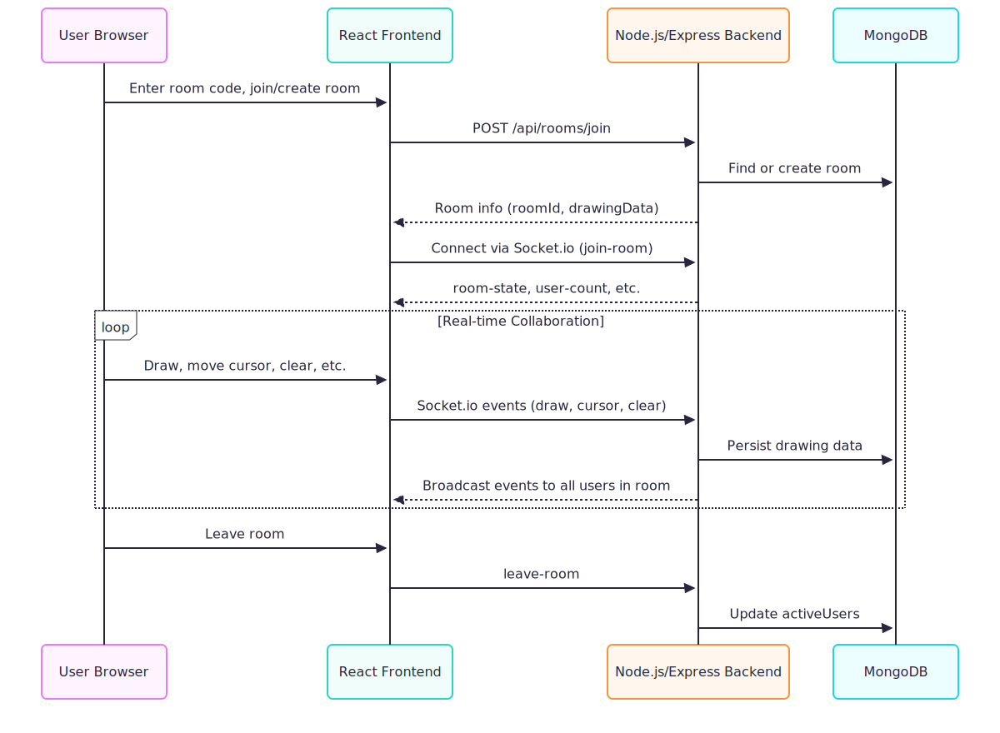

# Collaborative Whiteboard App

## 📦 Setup Instructions

### 1. Prerequisites
- **Node.js** (v16+ recommended)
- **npm** (comes with Node.js)
- **MongoDB** (local or cloud, e.g., MongoDB Atlas)

### 2. Clone the Repository
```bash
git clone <your-repo-url>
cd collabrative\ code
```

### 3. Install Dependencies
```bash
# In the project root
npm install

# Install client dependencies
cd client
npm install

# Install server dependencies
cd ../server
npm install
```

### 4. Configure Environment
- By default, the backend connects to MongoDB at `mongodb://localhost:27017/whiteboard`.
- To use a different MongoDB URI, set the `MONGODB_URI` environment variable in your shell or a `.env` file in the `server/` directory.

### 5. Start the Application
```bash
# Start the backend
cd server
npm start

# Start the frontend
cd ../client
npm run dev
```
- Frontend: [http://localhost:5173](http://localhost:5173)
- Backend API: [http://localhost:5000](http://localhost:5000)

---

## 📚 API Documentation

### REST Endpoints

#### `POST /api/rooms/join`
- **Description:** Join or create a room.
- **Body:** `{ "roomId": "ABC123" }`
- **Response:**
  ```json
  {
    "roomId": "ABC123",
    "createdAt": "...",
    "drawingData": [...]
  }
  ```

#### `GET /api/rooms/:roomId`
- **Description:** Get room info.
- **Response:**
  ```json
  {
    "roomId": "ABC123",
    "createdAt": "...",
    "lastActivity": "...",
    "drawingData": [...],
    "activeUsers": 2
  }
  ```

### Socket.io Events

#### Client → Server
- **join-room**: `{ roomId }` — Join a room.
- **leave-room**: `{ roomId }` — Leave a room.
- **cursor-move**: `{ position: { x, y } }` — Update cursor position.
- **draw-start**: `{ x, y, color, width }` — Start drawing.
- **draw-move**: `{ x, y, color, width }` — Continue drawing.
- **draw-end**: `{ color, width }` — End drawing.
- **clear-canvas**: `{}` — Clear the canvas.

#### Server → Client
- **room-state**: `{ drawingData, users }` — Initial room state.
- **user-joined**: `{ userId, color }` — A user joined.
- **user-left**: `{ userId }` — A user left.
- **user-count**: `{ count }` — Number of users in the room.
- **cursor-move**: `{ userId, position }` — Another user's cursor moved.
- **draw-start/draw-move/draw-end**: Drawing events from other users.
- **clear-canvas**: `{ userId }` — Canvas was cleared.

---

## 🏛️ Architecture Overview

The following sequence diagram illustrates the high-level system design and data flow for the collaborative whiteboard app:

### System Design (Sequence Diagram)

<p align="center">
  
</p>


## ✅ Summary
- **Setup:** Install Node, npm, MongoDB. Run `npm install` in all folders. Start backend and frontend.
- **API:** REST for room management, Socket.io for real-time drawing/cursor.
- **Architecture:** React frontend, Node/Express backend, MongoDB, Socket.io.
- **Deployment:** Build frontend, serve with backend, set env vars, use process manager for production.

---

---

# 🚀 Deploying on Render.com

## 1. Push Your Code to GitHub

- Make sure your project is on GitHub (public or private repo).

---

## 2. Create a MongoDB Atlas Database

- [Sign up for MongoDB Atlas](https://www.mongodb.com/cloud/atlas) if you haven’t already.
- Create a cluster, database user, and whitelist your IP (or 0.0.0.0/0 for development).
- Copy your connection string (see previous instructions).

---

## 3. Build Your Frontend Locally

Render’s free tier for static sites does not support custom build steps for monorepos.  
**So, build your React app locally and commit the build:**

```bash
cd client
npm install
npm run build
```

- This creates a `client/dist/` folder.

**Commit the `dist` folder to your repo:**
```bash
git add client/dist
git commit -m "Add production build"
git push
```

---

## 4. Prepare Your Backend to Serve the Frontend

In `server/server.js`, make sure you have:

```js
<code_block_to_apply_changes_from>
```

---

## 5. Create a Web Service on Render

1. Go to [https://dashboard.render.com/](https://dashboard.render.com/)
2. Click **New +** → **Web Service**
3. Connect your GitHub repo
4. Fill out the form:
   - **Name:** (your choice)
   - **Root Directory:** `server`
   - **Build Command:** `npm install`
   - **Start Command:** `npm start`
   - **Environment:** Node
5. **Add Environment Variables:**
   - `MONGODB_URI` — your Atlas connection string
   - `PORT` — `10000` (Render sets this automatically, but you can use `process.env.PORT`)
6. Click **Create Web Service**

---

## 6. Wait for Build & Deploy

- Render will install dependencies and start your server.
- The backend will serve your React frontend from `client/dist`.

---

## 7. Visit Your Live App

- Once deployed, Render will give you a public URL (e.g., `https://your-app.onrender.com`)
- Open it in your browser and test!

---

## 8. (Optional) Set Up Automatic Deploys

- Whenever you push to your GitHub repo, Render will redeploy automatically.

---

## 9. (Optional) Custom Domain

- In Render dashboard, go to your service → **Settings** → **Custom Domains** to add your own domain.

---

# ✅ That’s it!

You now have a full-stack, production-ready app deployed on Render.com with:
- Node.js/Express backend
- React frontend (served from Express)
- MongoDB Atlas database
- HTTPS and auto-deploys

---
@Tarunchowdam

